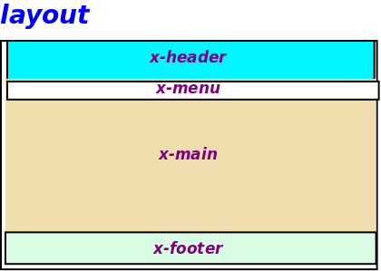

## Login modal

Creamos unos colores para tonalidad semitransparente
[Referencia web login modal](https://codeburst.io/creating-a-modal-dialog-with-tailwind-css-42722c9aea4f)

[*Mejor esta otra referencia](https://hdtuto.com/article/laravel-8-jetstream-livewire-crud-with-tailwind-modal)
````css
colors{
'smoke-darkest': 'rgba(0, 0, 0, 0.9)',
'smoke-darker': 'rgba(0, 0, 0, 0.75)',
'smoke-dark': 'rgba(0, 0, 0, 0.6)',
'smoke': 'rgba(0, 0, 0, 0.5)',
'smoke-light': 'rgba(0, 0, 0, 0.4)',
'smoke-lighter': 'rgba(0, 0, 0, 0.25)',
'smoke-lightest': 'rgba(0, 0, 0, 0.1)'
}
````


## Diseño de layout
* Para la pantalla principal realizamos el sisguiente layout
 


* Diseño de header


### subtítulos al vídeo
https://albertosantos.net/como-poner-subtitulos-a-un-video-en-una-web
https://stackoverflow.com/questions/18326973/clicking-html-5-video-element-to-play-pause-video-breaks-play-button